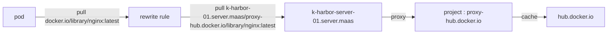

+++
title = 'RKE2 Private Registries Rewrite Rules'
+++
- [Step to rewrite docker.io to k-harbor-01.server.maas](#step-to-rewrite-dockerio-to-k-harbor-01servermaas)
  - [containerd private registries rewrite diagram](#containerd-private-registries-rewrite-diagram)
  - [Step to Add SelfSign prevent containerd x509 cert error](#step-to-add-selfsign-prevent-containerd-x509-cert-error)
  - [config rewrite ruls](#config-rewrite-ruls)
          - [Restart RKE Server](#restart-rke-server)

# Step to rewrite docker.io to k-harbor-01.server.maas

## containerd private registries rewrite diagram

refernces : https://docs.rke2.io/install/private_registry#mirrors



## Step to Add SelfSign prevent containerd x509 cert error

do this step on all master node and worker node

```shell
{
export HABOR_URL=k-harbor-01.server.maas:443
openssl s_client -connect ${HABOR_URL} -showcerts </dev/null 2>/dev/null | openssl x509 -outform PEM > 00-harbor-ca.crt 
sudo cp 00-harbor-ca.crt /usr/local/share/ca-certificates/00-harbor-ca.crt 
sudo update-ca-certificates
curl -k https://${HABOR_URL}
}
```

## config rewrite ruls

```shell
{
mkdir -p /etc/rancher/rke2/
PRIVATE_REPO_URL="k-harbor-01.server.maas:443"
cat <<EOF > /etc/rancher/rke2/registries.yaml
mirrors:
  docker.io:
    endpoint:
      - "https://${PRIVATE_REPO_URL}"
    rewrite:
      "(.*)": "proxy-hub.docker.io/\$1"
  hub.docker.io:
    endpoint:
      - "https://${PRIVATE_REPO_URL}"
    rewrite:
      "(.*)": "proxy-hub.docker.io/\$1"
  ghcr.io:
    endpoint:
      - "https://${PRIVATE_REPO_URL}"
    rewrite:
      "(.*)": "proxy-ghcr.io/\$1"
  gcr.io:
    endpoint:
      - "https://${PRIVATE_REPO_URL}"
    rewrite:
      "(.*)": "proxy-gcr.io/\$1"
  quay.io:
    endpoint:
      - "https://${PRIVATE_REPO_URL}"
    rewrite:
      "(.*)": "proxy-quay.io/\$1"
  registry.k8s.io:
    endpoint:
      - "https://${PRIVATE_REPO_URL}"
    rewrite:
      "(.*)": "proxy-registry.k8s.io/\$1"
  public.ecr.aws:
    endpoint:
      - "https://${PRIVATE_REPO_URL}"
    rewrite:
      "(.*)": "proxy-public.ecr.aws/\$1"
  registry.gitlab.com:
    endpoint:
      - "https://${PRIVATE_REPO_URL}"
    rewrite:
      "(.*)": "proxy-registry.gitlab.com/\$1"
EOF
cat /etc/rancher/rke2/registries.yaml
}
```

###### Restart RKE Server

```shell
{
systemctl restart rke2-agent
systemctl restart rke2-server
}
```