+++
title = 'Wireshark-TCPDUMP-Windows2003'
+++
- [Wireshark Download Link](#wireshark-download-link)
- [Useful Link](#useful-link)
- [ASCII - Diagram](#ascii---diagram)
- [Mermaid Diagram](#mermaid-diagram)
- [Step to Generate Report](#step-to-generate-report)
  - [Identify IP Adress \& Interface Name](#identify-ip-adress--interface-name)
  - [Install Wireshark](#install-wireshark)
  - [Open Wireshark](#open-wireshark)
  - [Start Capture Wireshark](#start-capture-wireshark)
  - [Stop Capturing After period of times](#stop-capturing-after-period-of-times)
  - [Open Statistics =\> Conversations](#open-statistics--conversations)
  - [View Captured Conversations](#view-captured-conversations)
- [Step to Export to Excel ( CSV File )](#step-to-export-to-excel--csv-file-)
  - [Open dump file in latest wireshark version](#open-dump-file-in-latest-wireshark-version)

# Wireshark Download Link

[:link: Wireshark Archived Download Link](https://2.na.dl.wireshark.org/win32/all-versions/)

# Useful Link

[:link: How the Internet Works, Part II - Layers](https://vahid.blog/post/2020-12-21-how-the-internet-works-part-ii-layers/)

[:link: How the Internet Works, Part III - Reliability and Security](https://vahid.blog/post/2020-12-24-how-the-internet-works-part-iii-reliability-and-security/)

# ASCII - Diagram 

```
 ________________            ________________
| Application    |          | Application    |
| Layer (Layer 7)|          | Layer (Layer 7)|
|   Port: 80     |          |   Port: 443    |
|________________|          |________________|
        |                            |
        v                            v
 ________________            ________________
| Presentation   |          | Presentation   |
| Layer (Layer 6)|          | Layer (Layer 6)|
|________________|          |________________|
        |                            |
        v                            v
 ________________            ________________
| Session        |          | Session        |
| Layer (Layer 5)|          | Layer (Layer 5)|
|________________|          |________________|
        |                            |
        v                            v
 ________________            ________________
| Transport      |          | Transport      |
| Layer (Layer 4)|          | Layer (Layer 4)|
|   TCP Port: 5000 |         |  TCP Port: 8080|
|________________|          |________________|
        |                            |
        v                            v
 ________________            ________________
| Network        |          | Network        |
| Layer (Layer 3)|          | Layer (Layer 3)|
|   192.168.1.2  |          |   192.168.1.3  |
|________________|          |________________|
        |                            |
        v                            v
 ________________            ________________
| Data Link      |          | Data Link      |
| Layer (Layer 2)|          | Layer (Layer 2)|
|  MAC: 00:11:22:33:44:55  |  MAC: 66:77:88:99:AA:BB  |
|________________|          |________________|
        |                            |
        v                            v
 ________________            ________________
| Physical       |          | Physical       |
| Layer (Layer 1)|          | Layer (Layer 1)|
|________________|          |________________|
        |                            |
        v                            v
     Computer A                    Computer B
```

# Mermaid Diagram

```mermaid
graph TD;
    subgraph "Nginx Server";
        subgraph "Application Layer (Layer 7)";
            AppA[Nginx]
        end
        subgraph "Presentation Layer (Layer 6)";
          PresentationA["-"]
        end
        subgraph "Session Layer (Layer 5)";
          SessionA["-"]
        end
        subgraph "Transport Layer (Layer 4)";
            TransA[TCP Port: 80]
        end
        subgraph "Network Layer (Layer 3)";
            IP_A[192.168.1.2]
        end
        subgraph "Data Link Layer (Layer 2)";
            MAC_A["MAC: 00:11:22:33:44:55"]
        end
        subgraph "Physical Layer (Layer 1)";
          DataLinkA["-"]
        end
    end
    
    subgraph "Client";
        subgraph "Application Layer (Layer 7)";
            AppB[Client]
        end
        subgraph "Presentation Layer (Layer 6)";
            PresentationB["-"]
        end
        subgraph "Session Layer (Layer 5)";
            SessionB["-"]
        end
        subgraph "Transport Layer (Layer 4)";
            TransB[TCP Port: 5000]
        end
        subgraph "Network Layer (Layer 3)";
            IP_B[192.168.1.3]
        end
        subgraph "Data Link Layer (Layer 2)";
            MAC_B["MAC: 66:77:88:99:AA:BB"]
        end
        subgraph "Physical Layer (Layer 1)";
          DataLinkB["-"]
        end
    end

    AppA --> PresentationA;
    PresentationA --> SessionA;
    SessionA --> TransA;
    TransA --> IP_A;
    IP_A --> MAC_A;
    MAC_A --> DataLinkA;


    AppB --> PresentationB;
    PresentationB --> SessionB;
    SessionB --> TransB;
    TransB --> IP_B;
    IP_B --> MAC_B;
    MAC_B --> DataLinkB;

    


```



# Step to Generate Report

## Identify IP Adress & Interface Name

Get IP Address & Interface Name from Windows Connections

| Type | Desc |
|---|---|
| Interface Name | Intel(R) PRO/1000 MT Network Connection |
| IP Address | 10.10.51.43 |


## Install Wireshark

Download & Install Wireshark


:warning: **Note** : use the correct version for each windows version
```
Older versions of Windows which are outside Microsoft’s extended lifecycle support window are no longer supported. It is often difficult or impossible to support these systems due to circumstances beyond our control, such as third party libraries on which we depend or due to necessary features that are only present in newer versions of Windows such as hardened security or memory management.

Wireshark 4.0 was the last release branch to officially support Windows 8.1 and Windows Server 2012.
Wireshark 3.6 was the last release branch to officially support 32-bit Windows.
Wireshark 3.2 was the last release branch to officially support Windows 7 and Windows Server 2008 R2.
Wireshark 2.2 was the last release branch to support Windows Vista and Windows Server 2008 sans R2
Wireshark 1.12 was the last release branch to support Windows Server 2003.
Wireshark 1.10 was the last release branch to officially support Windows XP.
```

## Open Wireshark

Open wireshark from Windows Start Button


## Start Capture Wireshark

Start Capture Package


| # | Step | Desc |
|---|---|---|
| 1 | Open Capture Options | Click Capture Options |
| 2 | Select Network Interface for Capturing | Intel(R) PRO/1000 MT Network Connection, ${INTERFACE_NAME} |
| 3 | Limit Capturing Packet Length | 68 bytes |
| 4 | Filter Capturing Packet | host 10.10.51.43, host ${INTERFACE_IP} |
| 5 | Specify Output File | dump_10.10.51.43, ${FILENAME} |
| 6 | Start Capturing | Click Start |

## Stop Capturing After period of times

Stop Packet Capturing 


| # | Step | Desc |
|---|---|---|
| 1 | Stop Packet Capturing | Click Stop |

## Open Statistics => Conversations

Open Statistics => Conversations


| # | Step | Desc |
|---|---|---|
| 1 | Open Statistics | Click Menu Statistics |
| 2 | Open Conversations| Click Menu Conversations |

## View Captured Conversations

View Captured Conversations


| # | Step | Desc |
|---|---|---|
| 1 | Open TCP Conversation | Click TCP |
| 2 | Source IP & Source Port | Source IP & Source Port is displayed |
| 3 | Dest IP & Dest Port | Dest IP & Source Port is displayed |


# Step to Export to Excel ( CSV File )

## Open dump file in latest wireshark version

Open dump file in latest wireshark version


