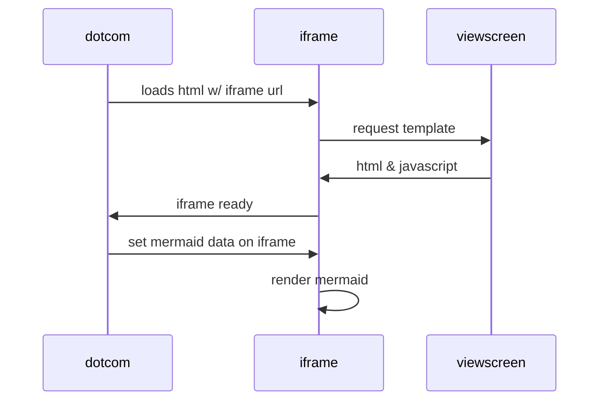

+++
title = 'How to write markdown'
+++
- [Ref](#ref)
- [Software](#software)
  - [Markdown Editor](#markdown-editor)
  - [Visual Code Extension : Markdown Preview](#visual-code-extension--markdown-preview)
  - [Markdown Drive Sync \& Git Storage](#markdown-drive-sync--git-storage)
- [Useful Links](#useful-links)
- [Markdown](#markdown)
  - [\[#\] Header](#-header)
    - [Code](#code)
    - [Result](#result)
- [Header 1](#header-1)
  - [Header 2](#header-2)
    - [Header 3](#header-3)
      - [Header 4](#header-4)
        - [Header 5](#header-5)
          - [Header 6](#header-6)
  - [\[^\] Footer](#-footer)
    - [Code](#code-1)
    - [Result](#result-1)
  - [\[\>\] Block Quotes](#-block-quotes)
    - [Code](#code-2)
    - [Result](#result-2)
  - [\[\*\] Italic Text](#-italic-text)
    - [Code](#code-3)
    - [Result](#result-3)
  - [\[\*\*\] Bold Text](#-bold-text)
    - [Code](#code-4)
    - [Result](#result-4)
  - [\[~~\] StrikeThrough](#-strikethrough)
    - [Code](#code-5)
    - [Result](#result-5)
  - [\[\`\`\`\] Code Blocks](#-code-blocks)
    - [Go Lang](#go-lang)
      - [Code](#code-6)
      - [Result](#result-6)
    - [Java](#java)
      - [Code](#code-7)
      - [Result](#result-7)
  - [\[---\] Title](#----title)
    - [Code](#code-8)
    - [Result](#result-8)
  - [Title](#title)
  - [\[\*\] Unorder List](#-unorder-list)
    - [Code](#code-9)
    - [Result](#result-9)
  - [\[1\] Number List](#1-number-list)
    - [Code](#code-10)
    - [Result](#result-10)
  - [\[|---|\] Table](#----table)
    - [Code](#code-11)
    - [Result](#result-11)
  - [\[:emoji:\] Emoji](#emoji-emoji)
    - [Code](#code-12)
    - [Result](#result-12)
  - [\[bracket\] Link](#bracket-link)
    - [Image](#image)
      - [Code](#code-13)
      - [Result](#result-13)
    - [Base64 Image](#base64-image)
      - [Code](#code-14)
      - [Result](#result-14)
    - [URL Link](#url-link)
      - [Code](#code-15)
      - [Result](#result-15)
  - [\[mermaid\] Diagram](#mermaid-diagram)
    - [Code](#code-16)
    - [Result](#result-16)
    - [Code](#code-17)
    - [Result](#result-17)


# Ref

# Software

## Markdown Editor

[:memo: Visual Code Studio](https://code.visualstudio.com/) 

## Visual Code Extension : Markdown Preview 

[:sparkles: Markdown : All in One](https://marketplace.visualstudio.com/items?itemName=yzhang.markdown-all-in-one)

[:heart_eyes: Markdown : Emoji](https://marketplace.visualstudio.com/items?itemName=bierner.markdown-emoji)

[:arrow_double_down: Markdown : Footnotes](https://marketplace.visualstudio.com/items?itemName=bierner.markdown-footnotes)

[:fish: Markdown : Mermaid Diagram Preview](https://marketplace.visualstudio.com/items?itemName=bierner.markdown-mermaid)

## Markdown Drive Sync & Git Storage

[:tophat: Google Drive Sync](https://www.google.com/drive/download/)

[:crown: Git SCM](https://git-scm.com/downloads) 

# Useful Links

[:ok_woman: Markdown Online Preview](https://markdownlivepreview.com/)

[:blush: Emoji - Preview](https://gist.github.com/rxaviers/7360908)

[:zap: Wiki.js markdown example](https://github.com/requarks/wiki-docs/blob/master/editors/markdown.md)

[:cyclone: Base64 Image Gen](https://yulvil.github.io/gopherjs/02/)


# Markdown

## [#] Header

### Code

```
# Header 1
## Header 2
### Header 3
#### Header 4
##### Header 5
###### Header 6
```

### Result


# Header 1
## Header 2
### Header 3
#### Header 4
##### Header 5
###### Header 6


## [^] Footer

### Code
```
Refer to Sun[^1] Moon[^2]
```

### Result
Refer to Sun[^1] Moon[^2]


## [>] Block Quotes

### Code
```
> ssh root@192.168.1.1
```

### Result
> ssh root@192.168.1.1

## [*] Italic Text

### Code
```markdown
*Wolfgang Amadeus Mozart* was born on 27 January 1756
```

### Result
*Wolfgang Amadeus Mozart* was born on 27 January 1756

## [**] Bold Text

### Code
```markdown
Wolfgang Amadeus **Mozart** was born on 27 January 1756
```

### Result
Wolfgang Amadeus **Mozart** was born on 27 January 1756


## [~~] StrikeThrough

### Code
```markdown
Wolfgang Amadeus Mozart was born on ~~1 Junuary 2024~~ 27 January 1756
```

### Result
Wolfgang Amadeus Mozart was born on ~~1 Junuary 2024~~ 27 January 1756


## [```] Code Blocks

### Go Lang

#### Code
````
```go
package main
import "fmt"

func main() {
    fmt.Println("hello world")
}
```
````

#### Result
```go
package main
import "fmt"

func main() {
    fmt.Println("hello world")
}
```

### Java

#### Code
````
```java
public class HelloWorld {
    public static void main(String[] args) {
        System.out.println("Hello, World!");
    }
}
```
````

#### Result
```java
public class HelloWorld {
    public static void main(String[] args) {
        System.out.println("Hello, World!");
    }
}
```

## [---] Title

### Code

```markdown
Title
---
Desc
```

### Result

Title
---
Desc

## [*] Unorder List


### Code

```markdown
* Item 1
* Item 2
* Item 2a
* Item 2b
```

### Result

* Item 1
* Item 2
* Item 2a
* Item 2b

## [1] Number List

### Code

```markdown
1. Item 1
2. Item 2
3. Item 3
    1. Item 3a
    2. Item 3b
```

### Result
1. Item 1
2. Item 2
3. Item 3
    1. Item 3a
    2. Item 3b


## [|---|] Table

### Code

```markdown
| id | name | surname |
|---|---|---|
| 1 | apple | watch |
| 2 | bee | hive |
| 3 | cat | me |
```

### Result

| id | name | surname |
|---|---|---|
| 1 | apple | watch |
| 2 | bee | hive |
| 3 | cat | me |

## [:emoji:] Emoji

### Code

```markdown
This is :apple: :watch:
```

### Result
This is :apple: :watch:

## [bracket] Link

### Image 

#### Code
```markdown

```

#### Result


### Base64 Image

#### Code
```markdown
![MyBase64Image](data:image/png;base64,iVBORw0KGgoAAAANSUhEUgAAAQAAAAEACAIAAADTED8xAAADMElEQVR4nOzVwQnAIBQFQYXff81RUkQCOyDj1YOPnbXWPmeTRef+/3O/OyBjzh3CD95BfqICMK0CMK0CMK0CMK0CMK0CMK0CMK0CMK0CMK0CMK0CMK0CMK0CMK0CMK0CMK0CMK0CMK0CMK0CMK0CMK0CMK0CMK0CMK0CMK0CMK0CMK0CMK0CMK0CMK0CMK0CMK0CMK0CMK0CMK0CMK0CMK0CMK0CMK0CMK0CMK0CMK0CMK0CMK0CMK0CMK0CMK0CMK0CMK0CMK0CMK0CMK0CMK0CMK0CMK0CMK0CMK0CMK0CMK0CMK0CMK0CMK0CMK0CMK0CMK0CMK0CMK0CMK0CMK0CMK0CMK0CMK0CMK0CMK0CMK0CMK0CMK0CMK0CMK0CMK0CMK0CMK0CMK0CMK0CMK0CMK0CMK0CMK0CMK0CMK0CMK0CMK0CMK0CMK0CMK0CMK0CMK0CMK0CMK0CMK0CMK0CMK0CMK0CMK0CMK0CMK0CMK0CMK0CMK0CMK0CMK0CMK0CMK0CMK0CMK0CMK0CMK0CMK0CMK0CMK0CMK0CMK0CMK0CMK0CMK0CMK0CMK0CMK0CMK0CMK0CMK0CMK0CMK0CMK0CMK0CMK0CMK0CMK0CMK0CMK0CMK0CMK0CMK0CMK0CMK0CMK0CMK0CMK0CMK0CMK0CMK0CMK0CMK0CMK0CMK0CMK0CMK0CMK0CMK0CMK0CMK0CMK0CMK0CMK0CMK0CMK0CMK0CMK0CMK0CMK0CMK0CMK0CMK0CMK0CMK0CMK0CMK0CMK0CMK0CMK0CMK0CMK0CMK0CMK0CMK0CMK0CMK0CMK0CMK0CMK0CMK0CMK0CMK0CMK0CMK0CMK0CMK0CMK0CMK0CMK0CMK0CMK0CMK0CMK0CMK0CMK0CMK0CMK0CMK0CMK0CMK0CMK0CMK0CMK0CMK0CMK0CMK0CMK0CMK0CMK0CMK0CMK0CMK0CMK0CMK0CMK0CMK0CMK0CMK0CMK0CMK0CMK0CMK0CMK0CMK0CMK0CMK0CMK0CMK0CMK0CMK0CMK0CMK0CMK0CMK0CMK0CMK0CMK0CMK0CMK0CMK0CMK0CMK0CMO0TAAD//2Anhf4QtqobAAAAAElFTkSuQmCC
```

#### Result
![MyBase64Image](data:image/png;base64,iVBORw0KGgoAAAANSUhEUgAAAQAAAAEACAIAAADTED8xAAADMElEQVR4nOzVwQnAIBQFQYXff81RUkQCOyDj1YOPnbXWPmeTRef+/3O/OyBjzh3CD95BfqICMK0CMK0CMK0CMK0CMK0CMK0CMK0CMK0CMK0CMK0CMK0CMK0CMK0CMK0CMK0CMK0CMK0CMK0CMK0CMK0CMK0CMK0CMK0CMK0CMK0CMK0CMK0CMK0CMK0CMK0CMK0CMK0CMK0CMK0CMK0CMK0CMK0CMK0CMK0CMK0CMK0CMK0CMK0CMK0CMK0CMK0CMK0CMK0CMK0CMK0CMK0CMK0CMK0CMK0CMK0CMK0CMK0CMK0CMK0CMK0CMK0CMK0CMK0CMK0CMK0CMK0CMK0CMK0CMK0CMK0CMK0CMK0CMK0CMK0CMK0CMK0CMK0CMK0CMK0CMK0CMK0CMK0CMK0CMK0CMK0CMK0CMK0CMK0CMK0CMK0CMK0CMK0CMK0CMK0CMK0CMK0CMK0CMK0CMK0CMK0CMK0CMK0CMK0CMK0CMK0CMK0CMK0CMK0CMK0CMK0CMK0CMK0CMK0CMK0CMK0CMK0CMK0CMK0CMK0CMK0CMK0CMK0CMK0CMK0CMK0CMK0CMK0CMK0CMK0CMK0CMK0CMK0CMK0CMK0CMK0CMK0CMK0CMK0CMK0CMK0CMK0CMK0CMK0CMK0CMK0CMK0CMK0CMK0CMK0CMK0CMK0CMK0CMK0CMK0CMK0CMK0CMK0CMK0CMK0CMK0CMK0CMK0CMK0CMK0CMK0CMK0CMK0CMK0CMK0CMK0CMK0CMK0CMK0CMK0CMK0CMK0CMK0CMK0CMK0CMK0CMK0CMK0CMK0CMK0CMK0CMK0CMK0CMK0CMK0CMK0CMK0CMK0CMK0CMK0CMK0CMK0CMK0CMK0CMK0CMK0CMK0CMK0CMK0CMK0CMK0CMK0CMK0CMK0CMK0CMK0CMK0CMK0CMK0CMK0CMK0CMK0CMK0CMK0CMK0CMK0CMK0CMK0CMK0CMK0CMK0CMK0CMK0CMK0CMK0CMK0CMK0CMK0CMK0CMK0CMK0CMK0CMK0CMK0CMK0CMK0CMK0CMK0CMK0CMK0CMK0CMK0CMK0CMK0CMK0CMK0CMK0CMK0CMO0TAAD//2Anhf4QtqobAAAAAElFTkSuQmCC
)


### URL Link
#### Code

```markdown
[Click here to go to somewhere else](https://www.google.com)
```

#### Result
[Click here to go to somewhere else](https://www.google.com)


## [mermaid] Diagram

### Code

````

````

### Result


### Code

````

````

### Result


[^1]: Sun : The Sun is the star at the center of the Solar System.
[^2]: Moon : The Moon is Earth's only natural satellite.