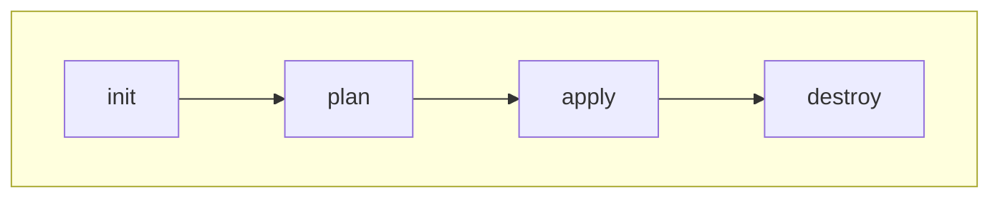
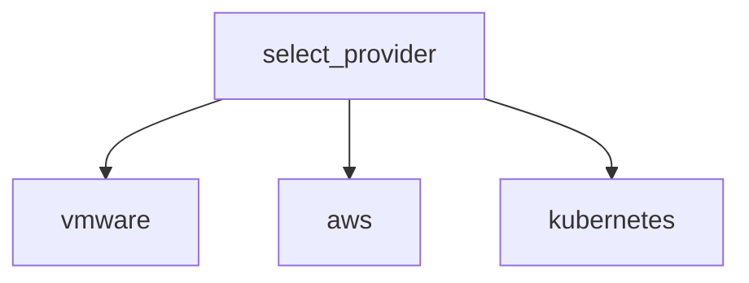
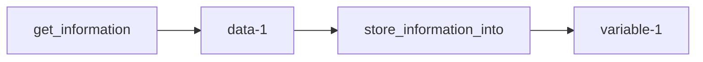
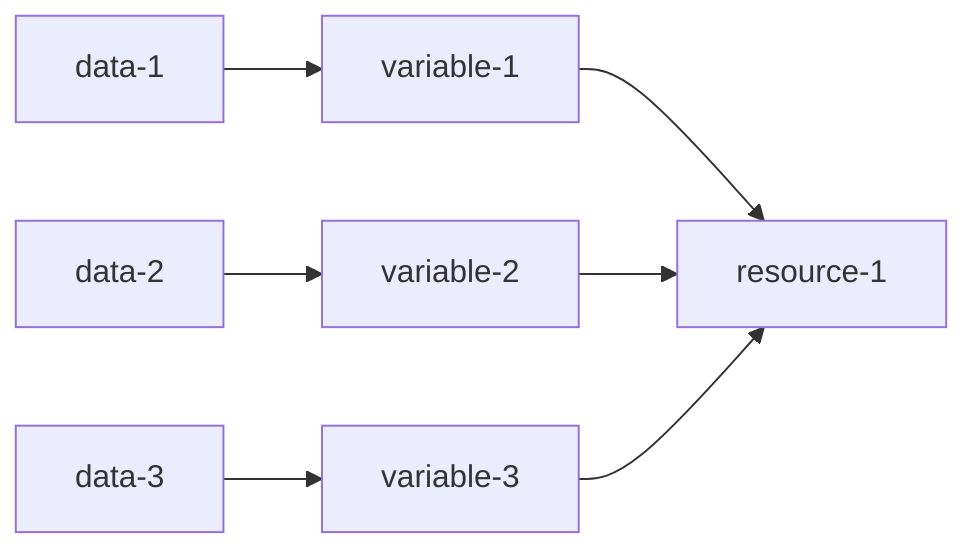
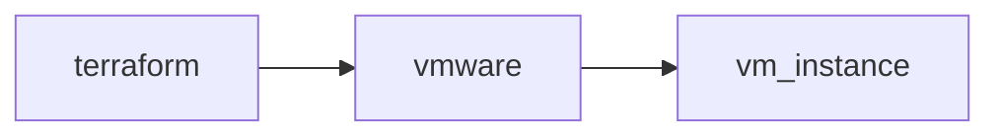
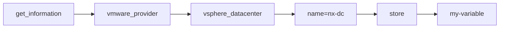
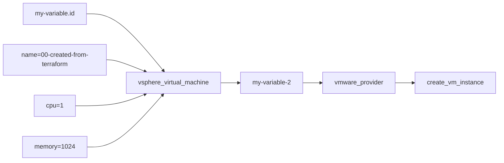

+++
title = 'Terraform Jumpstart'
+++

- [Install Terraform](#install-terraform)
  - [Install Terraform Document](#install-terraform-document)
- [Run Terraform](#run-terraform)
  - [Diagram](#diagram)
  - [Terraform Command](#terraform-command)
- [Terraform Providers list](#terraform-providers-list)
  - [Browse Terraform Providers](#browse-terraform-providers)
  - [useful Provider](#useful-provider)
  - [Documentation](#documentation)
  - [Concept](#concept)
    - [1. **Select Provider** ( eg. VMWare, Kubernetes, AWS )](#1-select-provider--eg-vmware-kubernetes-aws-)
    - [2. Get Info from **Data** Source into **Variable**](#2-get-info-from-data-source-into-variable)
    - [3. To **Provision** Resource, Put the **Required Data Source** into the Resource](#3-to-provision-resource-put-the-required-data-source-into-the-resource)
    - [Example : Flow Create VM Instance](#example--flow-create-vm-instance)
  - [Terraform Syntax](#terraform-syntax)
    - [use "data" to query](#use-data-to-query)
    - [use "resource" to provision](#use-resource-to-provision)
- [Terraform Code Example](#terraform-code-example)
  - [VMWare](#vmware)
    - [Example : Create VM](#example--create-vm)
    - [variables.tf example](#variablestf-example)
    - [example terraform.tfvars](#example-terraformtfvars)


# Install Terraform

## Install Terraform Document

[Install Terraform](https://developer.hashicorp.com/terraform/tutorials/aws-get-started/install-cli)

# Run Terraform

## Diagram



## Terraform Command

- terraform init
- terraform plan
- terraform apply
- terraform destroy


# Terraform Providers list

## Browse Terraform Providers

[Browse Terraform Provider](https://registry.terraform.io/browse/providers)

## useful Provider

[Provider : VMWare](https://registry.terraform.io/providers/hashicorp/vsphere/latest)

[Provider : Kubernetes](https://registry.terraform.io/providers/hashicorp/kubernetes/latest)

[Provider :AWS](https://registry.terraform.io/providers/hashicorp/aws/latest)

## Documentation

[Provider Documents : VMWare](https://registry.terraform.io/providers/hashicorp/vsphere/latest/docs)

[Provider Documents :Kubernetes](https://registry.terraform.io/providers/hashicorp/kubernetes/latest/docs)

[Provider Documents :AWS](https://registry.terraform.io/providers/hashicorp/aws/latest/docs)


| Type | Description |
|---|---|
| Data | use this for query resource |
| Resources | use this for provision resource |


## Concept

### 1. **Select Provider** ( eg. VMWare, Kubernetes, AWS )


---

### 2. Get Info from **Data** Source into **Variable**


---

### 3. To **Provision** Resource, Put the **Required Data Source** into the Resource



---

### Example : Flow Create VM Instance

**Create VMware Instance**



---

**Query : Data**

```HCL
data "vsphere_datacenter" "my-variable" {
  name = "nx-dc"
}
```




---

**Provision : Resource**

```HCL
resource "vsphere_virtual_machine" "my-variable-2" {
  datacenter       = data.vsphere_datacenter.my-variable.id
  ...
  name             = "00-created-from-terraform"
  num_cpus         = 1
  memory           = 1024  
}
```




## Terraform Syntax

### use "data" to query

```HCL
data "vsphere_datacenter" "my-variable" {
  name = "nx-dc"
}
```
- Query vsphere_datacenter = "nx-dc"
- Store Information into my-variable

### use "resource" to provision

```HCL
resource "vsphere_virtual_machine" "vm" {
  datacenter       = data.vsphere_datacenter.my-variable.id
  ...
  name             = "00-created-from-terraform"
  num_cpus         = 1
  memory           = 1024  
}
```
- Query vsphere_datacenter = "nx-dc"
- Store Information into my-variable


# Terraform Code Example

## VMWare

### Example : Create VM

```HCL
provider "vsphere" {
  user                 = "administrator@nx.local"
  password             = "ChangeThisPassword"
  vsphere_server       = "10.98.20.198"
  allow_unverified_ssl = true
}


#=============================================================

data "vsphere_datacenter" "datacenter" {
  name = "nx-dc"
}

data "vsphere_datastore" "datastore" {
  name          = "Local-Disk-204-02"
  datacenter_id = data.vsphere_datacenter.datacenter.id
}

data "vsphere_compute_cluster" "cluster" {
  name          = "nx-cluster"
  datacenter_id = data.vsphere_datacenter.datacenter.id
}

data "vsphere_network" "network" {
  name          = "C3750_10_PXE"
  datacenter_id = data.vsphere_datacenter.datacenter.id
}

resource "vsphere_virtual_machine" "vm" {
  name             = "00-created-from-terraform"
  resource_pool_id = data.vsphere_compute_cluster.cluster.resource_pool_id
  datastore_id     = data.vsphere_datastore.datastore.id
  num_cpus         = 1
  memory           = 1024
  guest_id         = "other3xLinux64Guest"
  firmware         = "efi"
  #force_power_off  = "true"
  #vvtd_enabled     = "false"
  enable_disk_uuid = "true"
  hv_mode          = "hvAuto"
  nested_hv_enabled = "true"
  #wait_for_guest_net_timeout = 5
  #wait_for_guest_ip_timeout  = 5
  network_interface {
    network_id = data.vsphere_network.network.id
    adapter_type = "e1000e"
  }
  disk {
    label = "disk0"
    size  = "1"
    thin_provisioned = "false"
  }
}
```


### variables.tf example

```HCL
variable "vmware_user" {
  description = "The name to use for all the cluster resources"
  type        = string
  default = "vmware_user"
}

variable "vmware_password" {
  description = "The name to use for all the cluster resources"
  type        = string
  default = "vmware_password"
}

variable "vmware_vcenter_server" {
  description = "The name to use for all the cluster resources"
  type        = string
  default = "vmware_vcenter_server"
}

variable "vmware_vcenter_allow_unverified_ssl" {
  description = "The name to use for all the cluster resources"
  type        = bool
  default = true
}

variable "cluster_name" {
  description = "The name to use for all the cluster resources"
  type        = string
  default = "my_cluster_name"
}

variable "datacenter_name" {
  description = "The name to use for all the cluster resources"
  type        = string
  default = "my_datacenter_name"
}

variable "datastore_name" {
  description = "Datastore Name"
  type        = string
  default = "my_datastore_name"
}

variable "network_name" {
  description = "Network Name"
  type        = string
  default = "my_network_name"
}

variable "vm_name" {
  description = "VM Name"
  type        = string
  default = "my_instnace_name"
}

variable "vcpu" {
  description = "VCPU"
  type        = string
  default = "1"
}

variable "memory" {
  description = "Memory"
  type        = string
  default = "1"
}

variable "disk_size" {
  description = "Disk Size"
  type        = string
  default = "30"
}
```

### example terraform.tfvars

```conf
vmware_user                 = "administrator@nx.local"
vmware_password             = "ChangeThisPassword"
vmware_vcenter_server       = "10.98.20.198"
vmware_vcenter_allow_unverified_ssl = true
datacenter_name = "nx-dc"
```