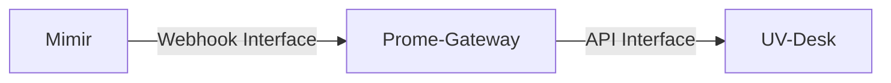

+++
title = 'UV-DESK'
+++
- [FLOW](#flow)
- [Mimir](#mimir)
  - [Need to Setup](#need-to-setup)
- [Prom Gateway Code](#prom-gateway-code)
  - [GitHub](#github)
- [UV-DESK](#uv-desk)
  - [Create Ticket](#create-ticket)
  - [URL for CEATE TICKET](#url-for-ceate-ticket)

#  FLOW




# Mimir

## Need to Setup

Need to Setup


# Prom Gateway Code

## GitHub

REPOSITORY : https://github.com/techguys-tidc/prome-alert-gateway

# UV-DESK

UV-DESK : http://10.10.54.4/uvdesk-community-v1.1.7/public/en/member/dashboard

```shell
url : http://10.10.54.4/uvdesk-community-v1.1.7/public/en/member/dashboard
Username : admin@admin.com
Password : xassddf
```

## Create Ticket

example create ticket : https://github.com/uvdesk/api-bundle/issues/8


## URL for CEATE TICKET
http://10.10.54.4/uvdesk-community-v1.1.7/public/api/v1/ticket